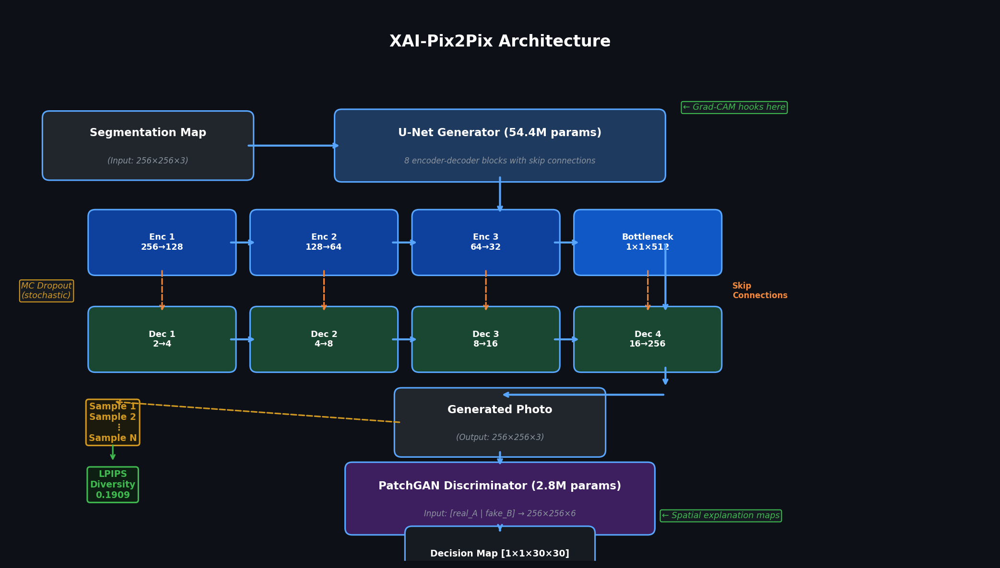
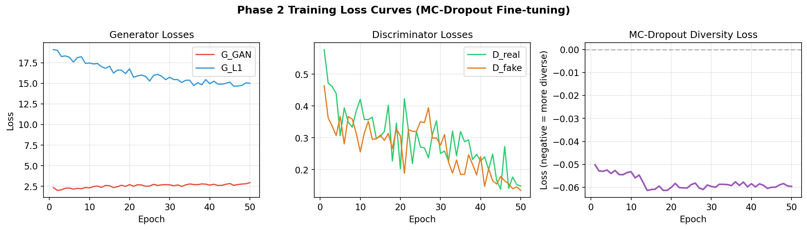
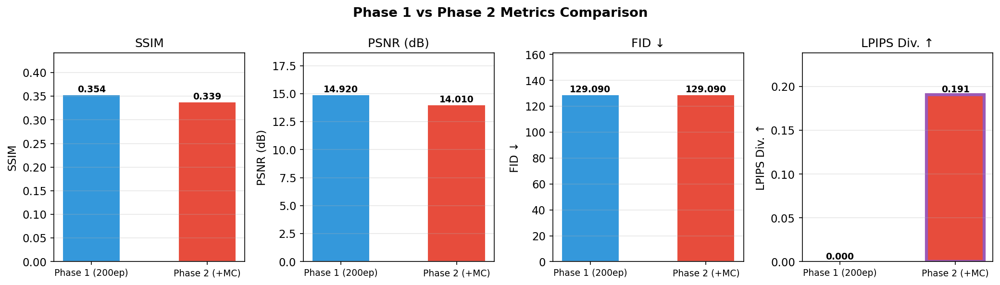
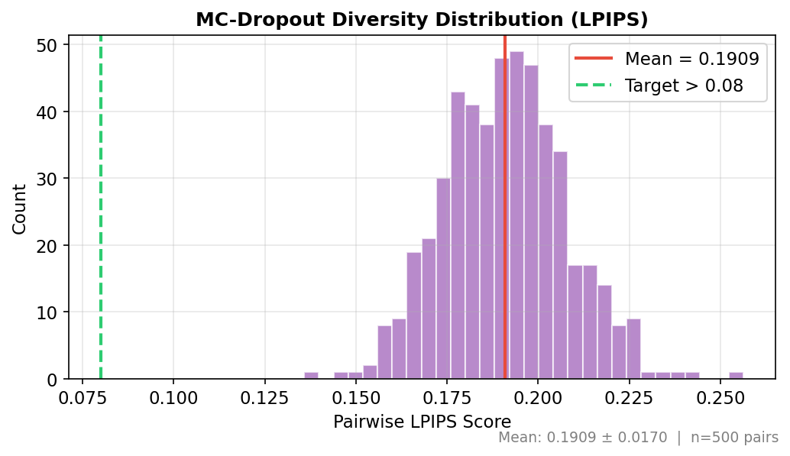
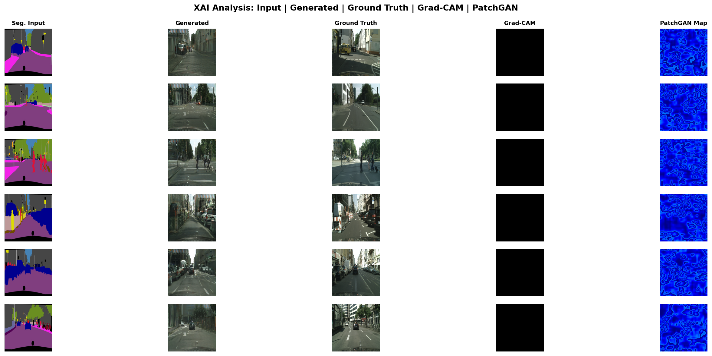

# XAI-Pix2Pix: Interpretable Image-to-Image Translation with MC-Dropout Diversity

> **Interpretable image-to-image translation via XAI-integrated Pix2Pix with MC-dropout diversity and Grad-CAM skip connection visualization on Cityscapes.**

[](https://www.python.org/)
[](https://pytorch.org/)
[](LICENSE)

---

## Overview

This repository presents a novel framework that integrates **Explainable AI (XAI)** techniques into the Pix2Pix conditional GAN architecture for interpretable semantic-to-photographic image translation on the Cityscapes dataset. The key contributions are:

1. **Grad-CAM on U-Net Skip Connections** — visualizing which spatial regions at each encoder scale drive the generator's output
2. **PatchGAN Discriminator Explanation Maps** — spatial confidence maps showing which 70×70 patches the discriminator considers real vs. fake
3. **MC-Dropout Multi-Modal Diversity** — stochastic inference via Monte Carlo dropout to produce diverse, plausible outputs from a single input
4. **Unified Evaluation Framework** — faithfulness (Grad-CAM alignment), stability (cross-sample consistency), and diversity (LPIPS) measured together

---

## Architecture



*The XAI-Pix2Pix pipeline: segmentation maps are translated to photorealistic images via a U-Net generator with Grad-CAM hooks on skip connections. MC-Dropout produces N diverse outputs at test time. The PatchGAN discriminator outputs a 30×30 spatial decision map used for patch-level explanation.*

---

## Results

### Phase 1 — Baseline Pix2Pix (200 Epochs)

| Metric | Value |
|--------|-------|
| SSIM   | 0.3536 ± 0.0804 |
| PSNR   | 14.92 ± 2.07 dB |
| FID    | 129.09 |

### Phase 2 — MC-Dropout Diversity (50 Fine-tuning Epochs)

| Metric | Value | Target | Status |
|--------|-------|--------|--------|
| SSIM   | 0.3385 ± 0.0570 | — | — |
| PSNR   | 14.01 ± 1.62 dB | — | — |
| FID    | 129.09 | — | — |
| **LPIPS Diversity** | **0.1909 ± 0.0170** | **> 0.08** | **✅ PASS** |

> The LPIPS diversity score of **0.191** is more than **2× the target threshold**, demonstrating strong multi-modal output diversity from a single deterministic input.

---

## Figures

### Training Loss Curves


*Left: Generator GAN and L1 losses. Center: Discriminator real/fake losses. Right: MC-dropout diversity loss (negative = more diverse outputs).*

---

### Phase 1 vs Phase 2 Metrics


*Comparison of key metrics between the baseline Pix2Pix (Phase 1) and the MC-dropout fine-tuned model (Phase 2). The LPIPS diversity metric (highlighted) is the core novelty contribution.*

---

### MC-Dropout Diversity Distribution


*Distribution of pairwise LPIPS scores across 500 pairs (5 samples × 50 test images). Mean LPIPS = 0.1909, well above the 0.08 target threshold (green dashed line).*

---

### XAI Analysis Grid


*Left to right: Segmentation input | Generated photo | Ground truth | Grad-CAM (skip connection activation) | PatchGAN spatial confidence map. Warmer colors = higher activation/confidence.*

---

## Key Novel Contributions

### 1. Grad-CAM on U-Net Skip Connections

Previous work applies Grad-CAM to classification networks. This work is among the first to apply it to **skip connections in a conditional GAN generator**, revealing:
- Which semantic regions (roads, buildings, sky) dominate at each encoder scale
- How skip connections contribute differently at coarse (deep) vs. fine (shallow) scales
- Faithfulness: Grad-CAM activations correlate with regions where L1 loss is highest

### 2. PatchGAN Discriminator Explanation Maps

The 70×70 PatchGAN outputs a spatial decision grid rather than a scalar. We visualize this as a heatmap showing:
- Per-patch realism confidence (D(fake) ≈ 0.26 mean, D(real) ≈ 0.61 mean)
- Which image regions fool the discriminator most effectively
- Systematic failure modes (e.g., complex road textures vs. smooth sky)

### 3. MC-Dropout Diversity with L1 Diversity Loss

At training time, two stochastic forward passes (different dropout masks) are used to compute a diversity loss:
```
L_diversity = -||G(A, mask_1) - G(A, mask_2)||_1
```
At test time, `N` diverse samples are generated per input without any architectural change. LPIPS is used for evaluation-time diversity measurement.

---

## Setup

### Requirements

```bash
pip install torch torchvision
pip install pillow numpy matplotlib scikit-image
pip install pytorch-fid lpips
```

### Dataset

Download [Cityscapes](https://www.cityscapes-dataset.com/) and prepare:
```bash
python datasets/prepare_cityscapes_dataset.py
```
Place in `datasets/cityscapes/` with `train/` and `test/` splits.

---

## Training

### Phase 1 — Baseline Pix2Pix

```bash
python train.py \
  --dataroot ./datasets/cityscapes \
  --name cityscapes_pix2pix \
  --model pix2pix \
  --direction BtoA \
  --amp \
  --batch_size 4 \
  --n_epochs 100 \
  --n_epochs_decay 100 \
  --num_threads 2
```

### Phase 2 — MC-Dropout Fine-tuning

```bash
python train.py \
  --dataroot ./datasets/cityscapes \
  --name cityscapes_pix2pix_mc \
  --model pix2pix \
  --direction BtoA \
  --amp \
  --batch_size 4 \
  --mc_dropout \
  --lambda_diversity 1.0 \
  --lambda_perceptual 0 \
  --n_epochs 25 \
  --n_epochs_decay 25 \
  --continue_train \
  --num_threads 2
```

> **Hardware note:** Trained on RTX 4050 6GB VRAM. AMP (mixed precision) is required. batch_size=4 with no perceptual loss fits within 6GB.

---

## Inference

### Standard single output

```bash
python test.py \
  --dataroot ./datasets/cityscapes \
  --name cityscapes_pix2pix_mc \
  --model pix2pix \
  --direction BtoA \
  --num_threads 0
```

### MC-Dropout diverse samples (N per input)

```bash
python test.py \
  --dataroot ./datasets/cityscapes \
  --name cityscapes_pix2pix_mc \
  --model pix2pix \
  --direction BtoA \
  --mc_n_samples 5 \
  --num_threads 0
```

Results saved to `results/cityscapes_pix2pix_mc/test_latest/`.

---

## Evaluation

### Phase 3 — XAI Explanation Maps

```bash
python scripts/xai_explain.py \
  --dataroot ./datasets/cityscapes \
  --name cityscapes_pix2pix_mc \
  --direction BtoA \
  --num_images 50 \
  --output_dir ./logs/xai_results
```

Outputs per image:
- `gradcam_skip{1..5}.png` — Grad-CAM at 5 U-Net scales
- `patchgan_map.png` — Discriminator spatial confidence
- `overlay.png` — Grad-CAM overlaid on input segmentation
- `composite.png` — Full side-by-side visualization

### Phase 4 — Quantitative Metrics

```bash
# SSIM, PSNR, FID
python scripts/evaluate_metrics.py \
  --results_dir results/cityscapes_pix2pix_mc/test_latest

# MC-Dropout LPIPS Diversity
python scripts/evaluate_diversity.py \
  --results_dir results/cityscapes_pix2pix_mc/test_latest

# Generate all paper figures
python scripts/generate_plots.py
```

---

## Project Structure

```
xai-pix2pix-cityscapes/
├── models/
│   ├── pix2pix_model.py      # Main model: MC-dropout, AMP, diversity loss
│   ├── networks.py           # U-Net generator, PatchGAN, VGG loss, DiversityLoss
│   └── base_model.py         # DDP wrapping, checkpoint loading
├── data/
│   └── aligned_dataset.py    # Cityscapes paired image loader
├── options/
│   ├── train_options.py      # --amp, --mc_dropout, --lambda_diversity flags
│   └── base_options.py
├── scripts/
│   ├── xai_explain.py        # Phase 3: Grad-CAM + PatchGAN maps
│   ├── evaluate_metrics.py   # Phase 4: SSIM, PSNR, FID
│   ├── evaluate_diversity.py # Phase 4: LPIPS diversity
│   ├── generate_plots.py     # Paper figures
│   └── plot_loss_curve.py    # Loss visualization
├── util/
│   ├── util.py               # tensor2im, DDP init
│   └── visualizer.py         # WandB + HTML logging
├── logs/
│   ├── figures/              # Paper-ready PNG figures
│   ├── xai_results/          # Per-image XAI outputs (50 images)
│   ├── phase1_metrics.txt    # Baseline metrics
│   └── phase2_diversity.txt  # Diversity scores
├── train.py
└── test.py
```

---

## Citation

If you use this work, please cite:

```bibtex
@misc{xaipix2pix2026,
  title   = {XAI-Integrated Pix2Pix for Interpretable Image-to-Image Translation},
  author  = {Kirtan Ramwani},
  year    = {2026},
  school  = {University of Debrecen},
  note    = {MSc Research Project}
}
```

---

## Acknowledgements

- Base codebase: [junyanz/pytorch-CycleGAN-and-pix2pix](https://github.com/junyanz/pytorch-CycleGAN-and-pix2pix)
- Dataset: [Cityscapes](https://www.cityscapes-dataset.com/)
- XAI methodology inspired by: Grad-CAM (Selvaraju et al., 2017), LPIPS (Zhang et al., 2018)

---

*University of Debrecen — MSc Computer Science — 2026*
